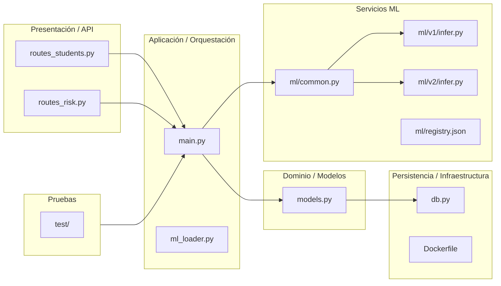

# Estructura por capas

Descripción breve de la arquitectura por capas aplicada en este repositorio.

Mapping de responsabilidades (archivos clave):

- **Presentación / API:** [backend/app/api/routes_students.py](backend/app/api/routes_students.py), [backend/app/api/routes_risk.py](backend/app/api/routes_risk.py)
- **Aplicación / Orquestación:** [backend/app/main.py](backend/app/main.py), [backend/app/ml_loader.py](backend/app/ml_loader.py)
- **Dominio / Modelos:** [backend/app/models.py](backend/app/models.py)
- **Persistencia / Infraestructura:** [backend/app/db.py](backend/app/db.py), [backend/Dockerfile](backend/Dockerfile)
- **Servicios ML:** [backend/app/ml/common.py](backend/app/ml/common.py), [backend/app/ml/v1/infer.py](backend/app/ml/v1/infer.py), [backend/app/ml/v2/infer.py](backend/app/ml/v2/infer.py), [backend/app/ml/registry.json](backend/app/ml/registry.json)
- **Pruebas:** carpeta [test/](test/)

Notas:

- Si quieres, puedo generar una imagen PNG del diagrama Mermaid y añadirla aquí.
- También puedo anotar funciones específicas dentro de cada archivo si necesitas responsabilidades más finas.
